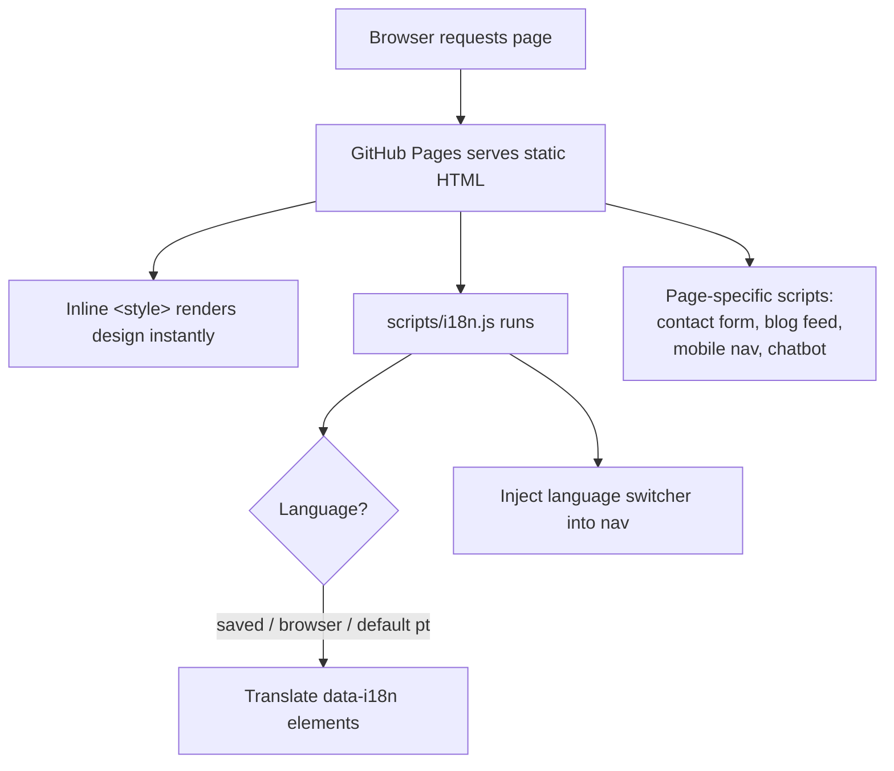
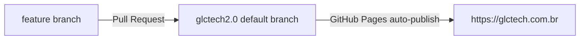

# GLCTech — Website (`site2.0`)

Marketing website for **GLCTech**, an IT monitoring & security company
(Zabbix, Grafana, Kaspersky, Veeam). Live at **https://glctech.com.br**.

This is a **static, no-build website**: plain HTML, CSS and vanilla JavaScript
served directly by **GitHub Pages**. There is no framework, no bundler, no
package manager, and no server-side code. You can open any `.html` file in a
browser and it works.

> **New here? Read this file top to bottom, then jump to
> [`docs/ARCHITECTURE.md`](docs/ARCHITECTURE.md).** Everything you need to be
> productive is in the `docs/` folder — see the [Documentation map](#documentation-map).

---

## Table of contents

- [Quick start](#quick-start)
- [Tech stack](#tech-stack)
- [Repository map](#repository-map)
- [How the site is built (mental model)](#how-the-site-is-built-mental-model)
- [Branching & deployment](#branching--deployment)
- [Common tasks — "How do I…?"](#common-tasks--how-do-i)
- [Documentation map](#documentation-map)
- [Conventions](#conventions)

---

## Quick start

There is nothing to install. To work on the site locally you only need a way to
serve static files (so that `fetch()` calls and root-absolute paths like
`/assets/...` resolve correctly — opening via `file://` breaks those).

```bash
# clone
git clone https://github.com/glctech/site2.0.git
cd site2.0

# serve locally (pick any one)
python3 -m http.server 8080      # → http://localhost:8080
# or
npx serve .                      # → http://localhost:3000
```

Then open `http://localhost:8080/index.html`.

> **Why a server and not just the file?** `index.html` fetches
> `/assets/data/stats.json` and the RSS blog feed, and the language switcher and
> analytics assume an `http(s)://` origin. `file://` will throw CORS/path
> errors. Always use a local server.

---

## Tech stack

| Layer            | Choice                                             | Notes |
|------------------|----------------------------------------------------|-------|
| Markup           | Hand-written HTML5                                  | One file per page |
| Styling          | CSS custom properties + **inline `<style>` blocks** | Most CSS lives inside each page's `<head>`; `css/styles.css` is a small shared/legacy sheet |
| Fonts            | Google Fonts — **Syne** (display) + **DM Sans** (body) | Loaded via `<link>` |
| Icons            | Font Awesome 6 (CDN)                                | |
| Scripting        | Vanilla JS (ES5-style, IIFEs)                       | No build; runs directly in the browser |
| i18n             | `scripts/i18n.js` (custom, 6 languages)             | See [`docs/I18N.md`](docs/I18N.md) |
| Hosting          | GitHub Pages + custom domain (`CNAME`)             | |
| Analytics        | Google Analytics 4 (`gtag.js`)                     | |
| Forms            | Web3Forms, HubSpot, JotForm                        | See [`docs/INTEGRATIONS.md`](docs/INTEGRATIONS.md) |
| Chat             | Tidio AI chatbot                                    | On `index.html` |
| Stats pipeline   | Python + Zabbix API → `assets/data/stats.json`     | See [`docs/ARCHITECTURE.md`](docs/ARCHITECTURE.md#stats-pipeline-zabbix--json) |

---

## Repository map

```
site2.0/
├── CNAME                     # Custom domain for GitHub Pages → glctech.com.br
├── README.md                 # ← you are here
├── docs/                     # Engineering documentation (start with ARCHITECTURE.md)
│
├── index.html                # Main single-page site (hero, services, team, contact…)
│
│   ── Service detail pages ──
├── zabbix.html               # Monitoring (Zabbix)
├── kaspersky.html            # Security (Kaspersky)
├── veeam.html                # Backup (Veeam)
│
│   ── Legal ──
├── politica.html             # Privacy policy
├── termos.html               # Terms of use
│
│   ── Team member profiles ──
├── andre.html                # André Luiz Cézar (CEO)
├── tchize.html               # Tchize Matias (Co-founder)
├── kawan.html                # Kawan Pablo (Cloud Architect)
│
│   ── Campaign / standalone pages ──
├── landing.html              # "Free IT diagnostic" landing page
├── ebook.html                # Zabbix e-book lead magnet (JotForm capture)
├── mailmkt.html              # HTML e-mail marketing template (table-based)
│
│   ── Shared / support ──
├── stats-snippet.html        # Copy-paste snippet that renders live Zabbix stats
│
├── scripts/
│   ├── i18n.js               # ★ ACTIVE translation engine (all pages load this)
│   ├── fetch_zabbix_stats.py # Zabbix API → assets/data/stats.json
│   └── script.js             # Small legacy nav toggle (not used by current pages)
│
├── css/
│   └── styles.css            # Small shared/legacy stylesheet
│
├── assets/
│   ├── logo/  team/  services/  hero/  partner/  flags/  linkedin.png
│   └── data/stats.json       # Generated Zabbix numbers (see stats pipeline)
│
├── kaspersky/                # Kaspersky product icon images
│
└── ── Legacy / DO NOT USE (kept for history) ──
    ├── js/i18n.js            # Old i18n attempt — NOT loaded anywhere
    ├── lang.js               # Old nested-object translations — NOT loaded
    └── lang/{en,pt}.json     # Old per-file translations — NOT loaded
```

> ⚠️ **`js/i18n.js`, `lang.js`, and `lang/*.json` are dead code.** They use a
> different key scheme (`nav_about`, `nav.home`) than the live pages
> (`data-i18n="nav.about"`) and are not referenced by any page. The **only**
> translation system in use is `scripts/i18n.js`. Don't edit the legacy files
> expecting a change on the site. Details in [`docs/I18N.md`](docs/I18N.md).

---

## How the site is built (mental model)

Each HTML page is **self-contained**: its own `<style>`, its own markup, and a
few shared `<script>` tags at the end. There is no templating, so shared pieces
(nav, footer, design tokens) are **duplicated per page** and kept consistent by
convention, not by tooling.

The one truly shared runtime piece is **`scripts/i18n.js`**, which every
customer-facing page loads. On load it:

1. Detects the visitor's language (saved preference → browser language → `pt`).
2. Injects a language-switcher dropdown into the nav.
3. Translates every element carrying a `data-i18n*` attribute from an embedded
   dictionary (pt / en / de / es / fr / it).



For the full page-by-page and subsystem breakdown, read
[`docs/ARCHITECTURE.md`](docs/ARCHITECTURE.md).

---

## Branching & deployment

- **Default branch: `glctech2.0`.** This is what GitHub Pages publishes.
- Deployment is **automatic**: pushing/merging to `glctech2.0` publishes to
  `https://glctech.com.br` within a minute or two. There is no build step.
- The custom domain is set by the `CNAME` file (`glctech.com.br`) — **do not
  delete it**, or GitHub Pages reverts to `*.github.io`.
- Work on feature branches named `claude/<topic>` (or your own convention) and
  open a Pull Request into `glctech2.0`.



> Because publish = merge, **preview changes locally first** (see
> [Quick start](#quick-start)). There is no staging environment.

---

## Common tasks — "How do I…?"

| I want to…                              | Go to |
|-----------------------------------------|-------|
| Change hero text, stats, testimonials   | [`docs/CONTENT-EDITING.md`](docs/CONTENT-EDITING.md) |
| Add/fix a translation or a new language | [`docs/I18N.md`](docs/I18N.md) |
| Understand a page or a JS subsystem     | [`docs/ARCHITECTURE.md`](docs/ARCHITECTURE.md) |
| Change a form's destination / API key   | [`docs/INTEGRATIONS.md`](docs/INTEGRATIONS.md) |
| Update the live "devices monitored" number | [`docs/ARCHITECTURE.md`](docs/ARCHITECTURE.md#stats-pipeline-zabbix--json) |
| Change the chatbot                       | [`docs/INTEGRATIONS.md`](docs/INTEGRATIONS.md#tidio-ai-chatbot) |

---

## Documentation map

| Document | What's inside |
|----------|---------------|
| [`docs/ARCHITECTURE.md`](docs/ARCHITECTURE.md) | Page-by-page tour, the shared design system, and every JS subsystem (i18n, blog feed, contact form, mobile nav, chatbot, stats pipeline) with data-flow diagrams. |
| [`docs/I18N.md`](docs/I18N.md) | Deep dive on the translation engine: detection order, the `data-i18n` attributes, how to add a key or a language, and the legacy files to ignore. |
| [`docs/INTEGRATIONS.md`](docs/INTEGRATIONS.md) | Every third-party service, where its key/ID lives, how to rotate it, and security notes. |
| [`docs/CONTENT-EDITING.md`](docs/CONTENT-EDITING.md) | Task-oriented recipes for editing copy, images, testimonials, services and team without touching the plumbing. |

---

## Conventions

- **Language of the code & content:** UI copy and code comments are mostly in
  **Brazilian Portuguese**. Keep that convention when editing.
- **Design tokens:** colors/fonts are defined as CSS custom properties at the
  top of each page's `:root { … }`. The brand red is **`#e6262c`**. Reuse the
  variables (`var(--red)`, `var(--dark)`, …) instead of hard-coding values.
- **Absolute vs relative asset paths:** pages mix `https://glctech.com.br/assets/...`
  and `./assets/...`. Both work in production; prefer root-relative or absolute
  for consistency when adding new references.
- **No secrets that aren't already public:** because everything ships to the
  browser, treat every key in the HTML as public (see
  [`docs/INTEGRATIONS.md`](docs/INTEGRATIONS.md) for which keys are safe to
  expose and which must stay in GitHub Actions).
