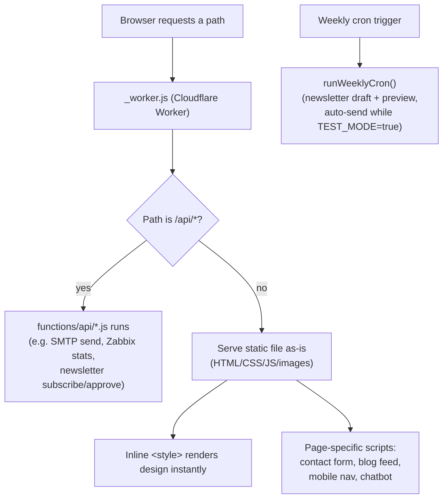
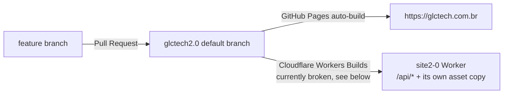

# GLCTech — Website (`site2.0`)

Marketing website for **GLCTech**, an IT monitoring & security company
(Zabbix, Grafana, Kaspersky, Veeam). Live at **https://glctech.com.br**
(Portuguese/Brazil). **https://glctechsec.com** is a separate, dedicated site
for English/European visitors (own Cloudflare account, not a mirror of this
repo's content) — see
[`docs/INTEGRATIONS.md`](docs/INTEGRATIONS.md#internationalization-retired)
for why this site is Portuguese-only.

This is a **static, no-build site** for the pages themselves — plain HTML, CSS
and vanilla JavaScript, one file per page, no framework/bundler/package
manager. But there **is** a small amount of server-side code: a Cloudflare
Worker (`_worker.js` + `functions/api/*`) that sends the site's e-mail forms
over SMTP, serves the live stats endpoint, and runs the **Boletim GLCTech**
newsletter agent (weekly AI-drafted security newsletter, D1-backed, human
approval required before any real send — see
[`docs/NEWSLETTER.md`](docs/NEWSLETTER.md)). See
[Hosting & deployment](#hosting--deployment) below.

> **New here? Read this file top to bottom, then jump to
> [`docs/ARCHITECTURE.md`](docs/ARCHITECTURE.md).** Everything you need to be
> productive is in the `docs/` folder — see the [Documentation map](#documentation-map).

---

## Table of contents

- [Quick start](#quick-start)
- [Tech stack](#tech-stack)
- [Repository map](#repository-map)
- [How the site is built (mental model)](#how-the-site-is-built-mental-model)
- [Hosting & deployment](#hosting--deployment)
- [Common tasks — "How do I…?"](#common-tasks--how-do-i)
- [Documentation map](#documentation-map)
- [Conventions](#conventions)

---

## Quick start

There is nothing to install. To work on the site locally you only need a way to
serve static files (so that `fetch()` calls and root-absolute paths like
`/assets/...` resolve correctly — opening via `file://` breaks those).

```bash
# clone
git clone https://github.com/glctech/site2.0.git
cd site2.0

# serve locally (pick any one)
python3 -m http.server 8080      # → http://localhost:8080
# or
npx serve .                      # → http://localhost:3000
```

Then open `http://localhost:8080/index.html`.

> **Why a server and not just the file?** `index.html` fetches
> `/assets/data/stats.json` and the RSS blog feed, and analytics assumes an
> `http(s)://` origin. `file://` will throw CORS/path errors. Always use a
> local server. (The e-mail forms won't work against a local server — they
> call the deployed Worker directly; see
> [`docs/INTEGRATIONS.md`](docs/INTEGRATIONS.md#zoho-mail-contact--careers-forms).)

---

## Tech stack

| Layer            | Choice                                             | Notes |
|------------------|----------------------------------------------------|-------|
| Markup           | Hand-written HTML5                                  | One file per page |
| Styling          | CSS custom properties + **inline `<style>` blocks** | Most CSS lives inside each page's `<head>`; `css/styles.css` is a small shared/legacy sheet |
| Fonts            | Google Fonts — **Syne** (display) + **DM Sans** (body) | Loaded via `<link>` |
| Icons            | Font Awesome 6 (CDN)                                | |
| Scripting        | Vanilla JS (ES5-style, IIFEs)                       | No build; runs directly in the browser |
| Hosting          | Cloudflare Workers (static assets + `_worker.js`) + custom domain (`CNAME`) | Git-connected; see [Hosting & deployment](#hosting--deployment) |
| Server-side      | `functions/api/*` (Cloudflare Pages Functions convention, routed by `_worker.js`) | E-mail sending (SMTP), live stats |
| Analytics        | Google Analytics 4 (`gtag.js`)                     | |
| Forms            | Zoho Mail SMTP, direct                              | See [`docs/INTEGRATIONS.md`](docs/INTEGRATIONS.md) |
| Chat             | Tidio AI chatbot                                    | Site-wide |
| Stats pipeline   | Python + Zabbix API (API Token auth) → `assets/data/stats.json` | See [`docs/ARCHITECTURE.md`](docs/ARCHITECTURE.md#stats-pipeline-zabbix--json) |
| Newsletter       | Cloudflare D1 + Anthropic API + the same Zoho SMTP client | Weekly cron drafts, human approval required — see [`docs/NEWSLETTER.md`](docs/NEWSLETTER.md) |

---

## Repository map

```
site2.0/
├── CNAME                     # Custom domain → glctech.com.br (see Hosting & deployment)
├── wrangler.toml              # Cloudflare Worker config (project name, D1 binding, cron, secrets doc)
├── .assetsignore              # Paths excluded from the static-assets upload (server code, docs, internal reports…)
├── _worker.js                 # Worker entrypoint: routes /api/* to functions/api/*, runs the newsletter cron, else serves static assets
├── README.md                 # ← you are here
├── docs/                     # Engineering documentation (start with ARCHITECTURE.md)
│
├── index.html                # Main single-page site (hero, services, team, contact, newsletter signup…)
├── diagnostico-zabbix.html   # Landing page: free 15-day Zabbix diagnostic
│
│   ── Service detail pages ──
├── zabbix.html               # Monitoring (Zabbix)
├── kaspersky.html            # Security (Kaspersky)
├── veeam.html                # Backup (Veeam)
│
│   ── Legal ──
├── politica.html             # Privacy policy
├── termos.html               # Terms of use
│
│   ── Careers ──
├── trabalhe-conosco.html     # Job openings + candidatura form
│
│   ── Standalone ──
├── mailmkt.html              # HTML e-mail marketing template (table-based)
│
│   ── Shared / support ──
├── stats-snippet.html        # Copy-paste snippet that renders live Zabbix stats
│
├── functions/api/             # Cloudflare Worker server-side code (routed by _worker.js)
│   ├── send-email.js          # POST /api/send-email — contact + candidatura forms
│   ├── stats.js                # GET /api/stats
│   ├── newsletter/             # Boletim GLCTech — subscribe/confirm/unsubscribe/generate/approve/cron-test
│   └── _lib/
│       ├── smtp.mjs            # Hand-rolled SMTP client (Zoho Mail, port 465), reused by the newsletter
│       ├── zabbix.mjs
│       └── newsletter/         # feeds.mjs, agent.mjs (Anthropic API), template.mjs, mailer.mjs, pipeline.mjs, security.mjs, page.mjs
│
├── migrations/                # D1 schema for the newsletter (subscribers, issues, company_news)
│
├── .github/
│   └── workflows/
│       └── zabbix-stats.yml  # Scheduled job: refresh assets/data/stats.json from Zabbix
│
├── scripts/
│   ├── fetch_zabbix_stats.py # Zabbix API → assets/data/stats.json (run by the workflow)
│   └── script.js             # Small legacy nav toggle (not used by current pages)
│
├── css/
│   └── styles.css            # Small shared/legacy stylesheet
│
├── assets/
│   ├── logo/  team/  services/  hero/  partner/  flags/  linkedin.png
│   ├── novidades/            # Screenshots featured in the newsletter's "Novidade GLCTech" section
│   └── data/stats.json       # Generated Zabbix numbers (see stats pipeline)
│
└── kaspersky/                # Kaspersky product icon images
```

---

## How the site is built (mental model)

Each HTML page is **self-contained**: its own `<style>`, its own markup, and a
few shared `<script>` tags at the end. There is no templating, so shared pieces
(nav, footer, design tokens) are **duplicated per page** and kept consistent by
convention, not by tooling. There used to be one shared runtime script
(`scripts/i18n.js`, a translation engine) — it was retired; see
[`docs/ARCHITECTURE.md`](docs/ARCHITECTURE.md#javascript-subsystems).

Most requests are for a static file (`.html`, `.css`, image, etc.) and are
served as-is. A handful of paths (`/api/send-email`, `/api/stats`,
`/api/newsletter/*`) are intercepted by the Worker and run actual
server-side code instead. A weekly cron trigger also runs the newsletter's
draft-generation pipeline directly (not over HTTP):



For the full page-by-page and subsystem breakdown, read
[`docs/ARCHITECTURE.md`](docs/ARCHITECTURE.md).

---

## Hosting & deployment

- **`https://glctech.com.br` is served by GitHub Pages** — confirmed via
  response headers (`x-github-request-id`, `via: 1.1 varnish`) and by
  diffing live content against the `glctech2.0` branch. **This corrects
  earlier docs/README text** that claimed a Cloudflare custom-domain binding
  intercepted this domain and that GitHub Pages "never actually serves live
  traffic for it" — that was wrong. GitHub Pages auto-rebuilds on every
  push/merge to `glctech2.0` (the default branch, set via the `CNAME` file —
  **do not delete it**), independent of anything Cloudflare-side. This is
  the deploy path for **all static HTML/CSS/JS/image changes**.
- **The Cloudflare Worker (`site2-0`, reachable at
  `site2-0.aluiz-cez.workers.dev`) is a separate thing**, Git-connected to
  this same repo via Cloudflare Workers Builds. It does **not** serve
  `glctech.com.br` — its job is running `/api/*` (contact/careers forms,
  live stats, the newsletter) as a cross-origin backend the static pages
  call into (see [`docs/INTEGRATIONS.md`](docs/INTEGRATIONS.md) for why it's
  cross-origin), and it separately hosts its own copy of the static assets
  under `[assets]` in `wrangler.toml` (mostly irrelevant — visitors never
  hit that domain directly). Deploying it is a **different action** from
  publishing the site: either Cloudflare Workers Builds picks up a push
  automatically, or someone runs `wrangler deploy` manually.
- **Secrets** (`ZOHO_SMTP_USER`, `ZOHO_SMTP_PASS`, `ZABBIX_*`,
  `ANTHROPIC_API_KEY`, `HMAC_SECRET`, `ADMIN_TOKEN`) live in the Worker's
  dashboard under *Settings → Variables and Secrets → **Runtime*** (not
  *Build*) — see [`docs/INTEGRATIONS.md`](docs/INTEGRATIONS.md) for which
  ones exist and what they do, and [`docs/NEWSLETTER.md`](docs/NEWSLETTER.md)
  for the newsletter-specific ones.
- **D1 database** (`glctech-newsletter`, binding `DB`) backs the newsletter —
  see [`docs/NEWSLETTER.md`](docs/NEWSLETTER.md).
- ⚠️ **Known issue:** the Cloudflare Workers Builds check (Git integration)
  has been failing on every push since the D1 binding was added, for reasons
  that need dashboard access to diagnose (see `docs/NEWSLETTER.md`). This
  only affects the **Worker** (so `/api/*` code and its own asset copy can
  go stale) — until it's fixed, deploy the Worker manually with
  `wrangler deploy` after merging anything that touches `functions/api/*`,
  `_worker.js` or `wrangler.toml`. **It does not affect `glctech.com.br`
  itself** — plain page/content changes go live via GitHub Pages on merge,
  no manual step needed.
- Work on feature branches named `claude/<topic>` (or your own convention) and
  open a Pull Request into `glctech2.0`.



> Because publish = merge, **preview changes locally first** (see
> [Quick start](#quick-start)). There is no staging environment. Note that
> local preview can't exercise `/api/*` — that only runs on the deployed
> Worker, and manual testing against production `/api/*` requires either a
> working Workers Builds pipeline or a manual `wrangler deploy` (see the
> known issue above).

---

## Common tasks — "How do I…?"

| I want to…                              | Go to |
|-----------------------------------------|-------|
| Change hero text, stats, testimonials   | [`docs/CONTENT-EDITING.md`](docs/CONTENT-EDITING.md) |
| Understand a page or a JS subsystem     | [`docs/ARCHITECTURE.md`](docs/ARCHITECTURE.md) |
| Change a form's destination / API key   | [`docs/INTEGRATIONS.md`](docs/INTEGRATIONS.md) |
| Update the live "devices monitored" number | [`docs/ARCHITECTURE.md`](docs/ARCHITECTURE.md#stats-pipeline-zabbix--json) |
| Change the chatbot                       | [`docs/INTEGRATIONS.md`](docs/INTEGRATIONS.md#tidio-ai-chatbot) |
| Add a company update to the next newsletter | [`docs/NEWSLETTER.md`](docs/NEWSLETTER.md) |
| Test the newsletter without waiting for the weekly cron | [`docs/NEWSLETTER.md`](docs/NEWSLETTER.md) — `POST /api/newsletter/cron-test` |

---

## Documentation map

| Document | What's inside |
|----------|---------------|
| [`docs/ARCHITECTURE.md`](docs/ARCHITECTURE.md) | Page-by-page tour, the shared design system, and every JS subsystem (blog feed, contact form, mobile nav, chatbot, stats pipeline) with data-flow diagrams. |
| [`docs/INTEGRATIONS.md`](docs/INTEGRATIONS.md) | Every third-party service, where its key/ID lives, how to rotate it, and security notes. |
| [`docs/CONTENT-EDITING.md`](docs/CONTENT-EDITING.md) | Task-oriented recipes for editing copy, images, testimonials, services and team without touching the plumbing. |
| [`docs/NEWSLETTER.md`](docs/NEWSLETTER.md) | The Boletim GLCTech newsletter agent: what's built, required secrets, test plan, go-live checklist, weekly operation, and the design decisions behind it. |
| [`AUDITORIA.md`](AUDITORIA.md) | The automated weekly/monthly technical maintenance agent (`auditor/`) — audits + a narrow safe auto-fix allowlist, opens draft PRs. |
| [`AUDIT-COMERCIAL.md`](AUDIT-COMERCIAL.md) | The automated weekly/monthly commercial/conversion/UX audit agent (`auditor/commercial/`) — strictly read-only, recommendations only. |

---

## Conventions

- **Language of the code & content:** UI copy and code comments are mostly in
  **Brazilian Portuguese**. Keep that convention when editing.
- **Design tokens:** colors/fonts are defined as CSS custom properties at the
  top of each page's `:root { … }`. The brand red is **`#e6262c`**. Reuse the
  variables (`var(--red)`, `var(--dark)`, …) instead of hard-coding values.
- **Asset paths are root-relative** (`/assets/...` or `./assets/...`) on every
  page — keep new references relative rather than hardcoding
  `https://glctech.com.br/...`. The only intentionally **absolute** URLs (to
  `glctech.com.br`, the canonical domain) are `mailmkt.html` (an e-mail has no
  "current origin") and `<link rel="canonical">` / `og:url` / `og:image` /
  `twitter:image` meta tags (social crawlers and canonicalization need an
  absolute URL) — plus the newsletter's functional links, which deliberately
  point at the Worker's own domain instead (see
  [`docs/NEWSLETTER.md`](docs/NEWSLETTER.md#por-que-os-links-funcionais-usam-outro-domínio)).
- **No secrets that aren't already public:** because everything ships to the
  browser, treat every key in the HTML as public (see
  [`docs/INTEGRATIONS.md`](docs/INTEGRATIONS.md) for which keys are safe to
  expose and which must stay in GitHub Actions).
- **Zabbix stats pipeline secrets:** `ZABBIX_URL` and `ZABBIX_TOKEN` live only
  in GitHub Actions Secrets, never in the frontend. Authentication uses a
  Zabbix **API Token** (not username/password) — see
  [`docs/ARCHITECTURE.md`](docs/ARCHITECTURE.md#stats-pipeline-zabbix--json)
  for how to rotate it.
