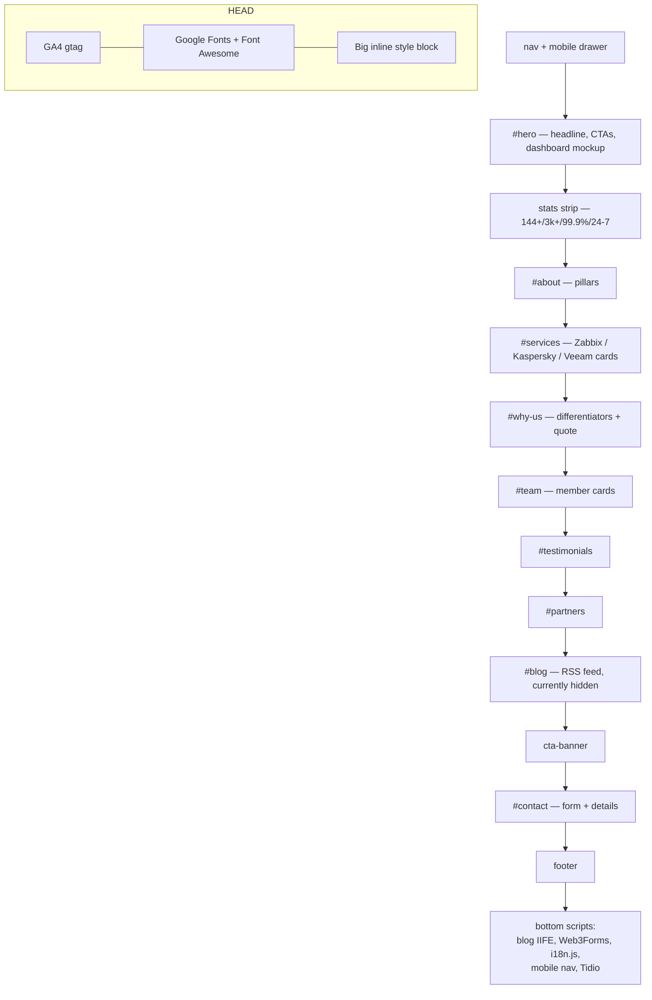
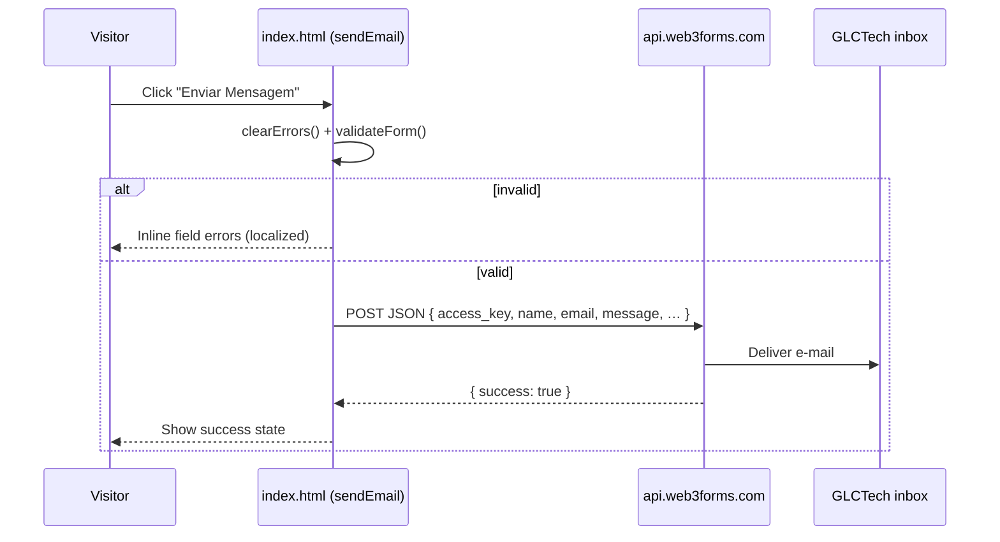
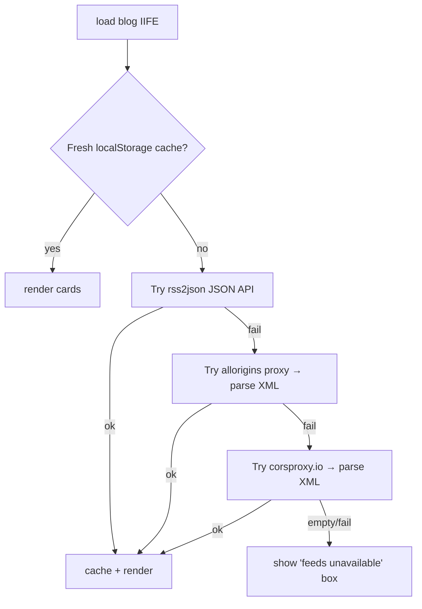
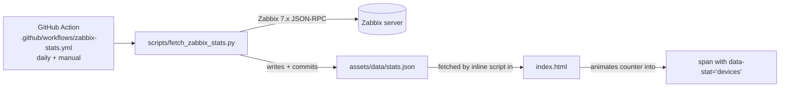

# Architecture

A tour of how the GLCTech site is put together — pages, the shared design
system, and every JavaScript subsystem. Read [`../README.md`](../README.md)
first for the high-level mental model.

- [Design philosophy](#design-philosophy)
- [Page inventory](#page-inventory)
- [The shared design system](#the-shared-design-system)
- [`index.html` anatomy](#indexhtml-anatomy)
- [JavaScript subsystems](#javascript-subsystems)
  - [1. Internationalization (i18n)](#1-internationalization-i18n)
  - [2. Language switcher](#2-language-switcher)
  - [3. Mobile navigation](#3-mobile-navigation)
  - [4. Contact form → Web3Forms](#4-contact-form--web3forms)
  - [5. Blog RSS feed (hidden)](#5-blog-rss-feed-hidden)
  - [6. Tidio AI chatbot](#6-tidio-ai-chatbot)
- [Stats pipeline (Zabbix → JSON)](#stats-pipeline-zabbix--json)
- [Data files](#data-files)
- [Gotchas & things that will bite you](#gotchas--things-that-will-bite-you)

---

## Design philosophy

- **No build step, ever.** What's in the repo is exactly what ships. This keeps
  onboarding trivial and deployment instant, at the cost of some duplication
  (each page repeats the nav, footer, and design tokens).
- **Per-page self-containment.** A page's CSS lives in a `<style>` block in its
  own `<head>`. You can understand and edit one page without touching any
  other.
- **One shared runtime script.** `scripts/i18n.js` is the only JS shared across
  all pages. Everything else is page-local `<script>` at the bottom of the body.
- **Progressive, fail-soft behavior.** Network features (blog feed, live stats,
  chat) degrade silently: if a fetch fails, the page keeps its static content.

---

## Page inventory

| Page | Purpose | Loads `i18n.js`? | Notable integrations |
|------|---------|:---:|----------------------|
| `index.html` | Main one-page site (all sections) | ✅ | GA4, Web3Forms (contact), RSS blog feed, Tidio chat |
| `zabbix.html` | Monitoring service detail | ✅ | GA4 |
| `kaspersky.html` | Security service detail | ✅ | GA4 |
| `veeam.html` | Backup service detail | ✅ | GA4 |
| `politica.html` | Privacy policy | ✅ | GA4 |
| `termos.html` | Terms of use | ✅ | GA4 |
| `andre.html` / `tchize.html` / `kawan.html` | Individual team-member profiles | — | — |
| `landing.html` | "Free IT diagnostic" campaign landing | — | HTML form (see note) |
| `ebook.html` | Zabbix e-book lead magnet | — | JotForm embed |
| `mailmkt.html` | HTML **e-mail** template (table layout) | — | Rendered inside e-mail clients, not the browser |
| `stats-snippet.html` | Reusable snippet to display live Zabbix stats | — | Reads `assets/data/stats.json` |

> **`landing.html` note:** its "Free Diagnostic" `<form>` submits to
> **Web3Forms** (same access key/inbox as the contact form → `contato@glctech.com.br`)
> via a small JS handler, with a native HTML POST fallback if JS is disabled.
> See [`INTEGRATIONS.md`](INTEGRATIONS.md#web3forms-contact-form).

> **`mailmkt.html` is an e-mail, not a web page.** It uses table-based layout
> and inline styles because e-mail clients don't support modern CSS. Don't
> "modernize" it with fl/grid — it will break in Outlook/Gmail.

---

## The shared design system

Because there's no templating, these pieces are duplicated per page and kept in
sync **by convention**. When you change one, check whether the others need the
same change.

### Design tokens (CSS custom properties)

Defined in each page's `:root`. The canonical set (from `index.html`):

```css
:root {
  --dark:        #2d2d2d;   /* page background */
  --dark-mid:    #242424;   /* alternating section bg */
  --dark-light:  #383838;   /* cards */
  --dark-border: #484848;   /* hairlines */
  --red:         #e6262c;   /* BRAND accent */
  --red-light:   #ff4a50;   /* hover */
  --white:       #ffffff;
  --gray:        #c9c9c9;   /* body text */
  --font-display: 'Syne', sans-serif;   /* headings */
  --font-body:    'DM Sans', sans-serif;/* body */
  --radius: 4px; --radius-lg: 8px;
  --transition: 0.22s ease;
}
```

**Always use the variables**, not raw hex. The brand red `#e6262c` in
particular appears in many places (icons, CTAs, chat) — changing the variable
should cascade.

### Navigation

Every main page has:

- A **fixed top nav** (`<nav>`) with the logo, section links, a red "Fale
  Conosco" CTA, and a hamburger button (`.hamburger`) shown under 900px.
- A **mobile drawer** (`#mobile-menu`) toggled by the hamburger.
- The **language switcher** is *not* in the HTML — it's injected into
  `.nav-links` at runtime by `scripts/i18n.js`.

### Footer

A four-column footer (brand blurb, Navigation, Services, Legal) plus a bottom
copyright bar. Duplicated per page.

### Responsive strategy

Single breakpoint philosophy with two media queries (`max-width: 900px` for the
tablet/mobile layout switch, `max-width: 480px` for small phones). Grids
collapse to one column; the desktop nav is replaced by the hamburger drawer.

---

## `index.html` anatomy

`index.html` is the whole homepage in one file. Sections top to bottom:



**Order matters for the scripts at the bottom:** the blog feed IIFE, the
Web3Forms contact handler, then `scripts/i18n.js`, then the mobile-nav handlers,
then the Tidio loader. `i18n.js` runs after the DOM exists and translates
in place.

Several elements are intentionally **hidden** via the `hidden` attribute and
kept in the markup for easy re-enabling: the `#blog` section, a third/fourth
testimonial, one partner badge, the "+50 projects" about badge, and the Kawan
team card (`style="display:none"`). Toggling them on is a content decision.

---

## JavaScript subsystems

### 1. Internationalization (i18n)

The single most important shared system. **Fully documented in
[`I18N.md`](I18N.md)** — here's the one-paragraph version:

`scripts/i18n.js` is a self-contained IIFE holding a dictionary for six
languages (`pt`, `en`, `de`, `es`, `fr`, `it`). On load it detects the language
(saved `localStorage['glctech_lang']` → browser languages → `pt`), builds a
switcher, and replaces the text/attributes/HTML of every element tagged with
`data-i18n`, `data-i18n-attr`, or `data-i18n-html`. Preference persists in
`localStorage`.

### 2. Language switcher

Built at runtime by `buildSwitcher()` inside `i18n.js` and appended to
`.nav-links`. It's a custom dropdown (flag + code) with its own injected CSS.

> **Important internal detail (previously a bug):** `applyLang()` updates the
> switcher's visual state through `window._glcSelectLang`, which points at a
> **UI-only** function (`syncSwitcherUI`). It must *not* point at `selectLang`
> (which calls `applyLang`), or you recreate an infinite
> `applyLang → selectLang → applyLang` recursion (`RangeError: Maximum call
> stack size exceeded`). This was fixed; keep the separation intact.

### 3. Mobile navigation

Plain handlers at the bottom of `index.html`: `toggleMenu()` / `closeMenu()`
add/remove an `.open` class on the hamburger and `#mobile-menu`, and lock body
scroll while open. A document-level click listener closes the drawer when you
click outside it.

### 4. Contact form → Web3Forms

The `#contact` form is submitted with JS (no page reload) to the **Web3Forms**
API, which forwards the message to GLCTech's inbox.



- Access key: `W3F_ACCESS_KEY` in the page's script. It's a **public**
  submission key (safe in client code). See [`INTEGRATIONS.md`](INTEGRATIONS.md#web3forms-contact-form).
- Validation errors are localized via `window._i18n_errors`, populated by
  `applyLang()` — that's the coupling between the form and i18n.

### 5. Blog RSS feed (hidden)

The `#blog` section pulls recent articles from Brazilian tech outlets. It is
**currently disabled** (`<section id="blog" hidden>`), but the code is complete
and resilient. It tries multiple proxies in sequence so a single CORS/outage
doesn't kill the feed, and caches results in `localStorage` for 25 minutes.



To re-enable, remove the `hidden` attribute from `<section id="blog">`. The
RSS2JSON API key lives in the IIFE (`RSS2JSON_KEY`).

### 6. Tidio AI chatbot

Loaded **asynchronously** just before `</body>` so it never blocks rendering.
A small companion script makes it feel native:

- Sets `document.tidioChatLang` from the site's detected language (same
  `localStorage['glctech_lang']` key as i18n) **before** the widget loads, so
  the chat opens in the visitor's language.
- On the `tidioChat-ready` event, exposes `window.glcOpenChat()` so any brand
  button can open the chat programmatically.

The widget's colors/avatar/greeting are configured in the **Tidio dashboard**
(not in code) — theme them to the brand red `#e6262c`. Currently the chatbot is
on `index.html` only; add the same two `<script>` blocks before `</body>` on
other pages to make it site-wide. See
[`INTEGRATIONS.md`](INTEGRATIONS.md#tidio-ai-chatbot).

---

## Stats pipeline (Zabbix → JSON)

The homepage "devices monitored" counter is driven by a **live pipeline**: a
scheduled GitHub Action pulls numbers from Zabbix into a committed JSON file,
which the homepage reads and animates on load.



**How it's wired:**

- **Workflow** — `.github/workflows/zabbix-stats.yml` runs daily (and on manual
  `workflow_dispatch`), executes `scripts/fetch_zabbix_stats.py`, and commits
  `assets/data/stats.json` if it changed. It **skips gracefully** (job succeeds,
  does nothing) until the Zabbix secrets are configured, so it never fails
  noisily.
- **Script** — `scripts/fetch_zabbix_stats.py`, given `ZABBIX_URL`,
  `ZABBIX_USER`, `ZABBIX_PASS`, logs into a Zabbix 7.x server, counts enabled
  hosts + active problems, and writes `assets/data/stats.json`.
- **Front-end** — `index.html` has `<span data-stat="devices">144</span>` (the
  `144` is the fallback) and an inline script near the bottom that fetches
  `stats.json` and animates the span to the live device count. If the fetch
  fails, the static fallback stays.
- **`stats-snippet.html`** remains as a standalone, copy-pasteable version of
  that front-end script if you want the same counter on another page.

**To activate the live numbers:** add repository secrets `ZABBIX_URL`,
`ZABBIX_USER`, `ZABBIX_PASS` (Settings → Secrets and variables → Actions). Until
then the homepage shows the committed `stats.json` value (or the `144` fallback).
Treat the Zabbix credentials as **secrets** — never commit them. See
[`INTEGRATIONS.md`](INTEGRATIONS.md#zabbix-api-stats-pipeline).

---

## Data files

| File | Produced by | Consumed by |
|------|-------------|-------------|
| `assets/data/stats.json` | `scripts/fetch_zabbix_stats.py` | `stats-snippet.html` |
| `localStorage['glctech_lang']` | `scripts/i18n.js` | i18n + chatbot language sync |
| `localStorage['glc_rss_v6']` | blog IIFE | blog IIFE (25-min cache) |

---

## Gotchas & things that will bite you

- **Only one translation system.** `scripts/i18n.js` is it. Three earlier dead
  attempts (`js/i18n.js`, `lang.js`, `lang/*.json`) were removed. See
  [`I18N.md`](I18N.md).
- **Duplicated nav/footer.** No includes — update shared chrome on every page.
- **Publish = merge to `glctech2.0`.** No staging. Preview locally.
- **`CNAME` must stay** or the custom domain breaks.
- **Client-side keys are public.** Anything in the HTML/JS is visible to
  visitors. Only the Zabbix credentials are meant to be secret (and they belong
  in CI, not the repo). See [`INTEGRATIONS.md`](INTEGRATIONS.md).
- **Serve over http, not `file://`.** `fetch()` and root-absolute paths need a
  real origin.
- **The i18n switcher recursion trap** described above — don't reintroduce it.
