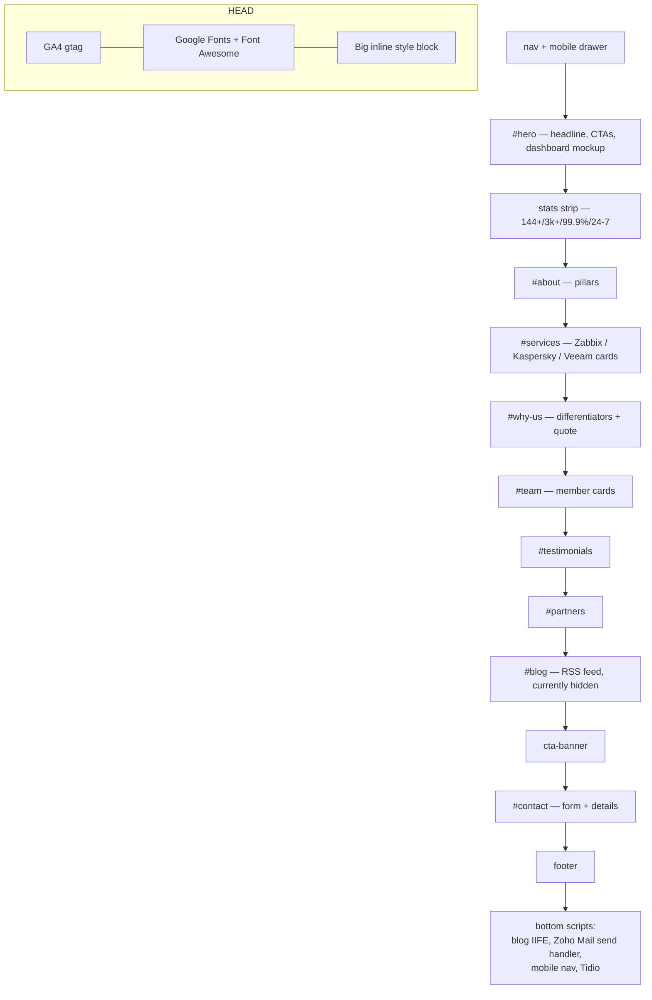
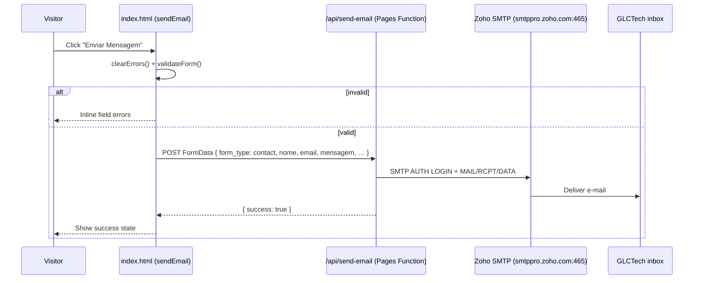
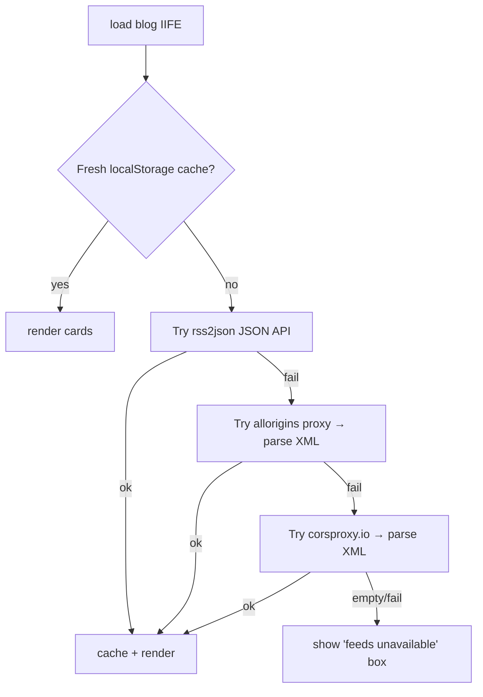
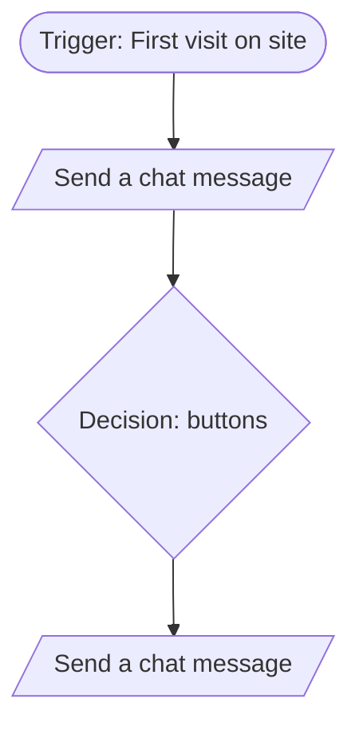
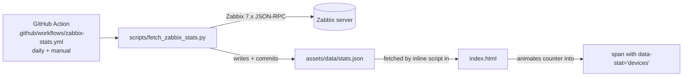

# Architecture

A tour of how the GLCTech site is put together — pages, the shared design
system, and every JavaScript subsystem. Read [`../README.md`](../README.md)
first for the high-level mental model.

- [Design philosophy](#design-philosophy)
- [Page inventory](#page-inventory)
- [The shared design system](#the-shared-design-system)
- [`index.html` anatomy](#indexhtml-anatomy)
- [JavaScript subsystems](#javascript-subsystems)
  - [1. Mobile navigation](#1-mobile-navigation)
  - [2. Contact form → Zoho Mail](#2-contact-form--zoho-mail)
  - [3. Blog RSS feed (hidden)](#3-blog-rss-feed-hidden)
  - [4. Tidio AI chatbot](#4-tidio-ai-chatbot)
- [Stats pipeline (Zabbix → JSON)](#stats-pipeline-zabbix--json)
- [Data files](#data-files)
- [Gotchas & things that will bite you](#gotchas--things-that-will-bite-you)

---

## Design philosophy

- **No build step, ever.** What's in the repo is exactly what ships. This keeps
  onboarding trivial and deployment instant, at the cost of some duplication
  (each page repeats the nav, footer, and design tokens).
- **Per-page self-containment.** A page's CSS lives in a `<style>` block in its
  own `<head>`. You can understand and edit one page without touching any
  other.
- **No shared runtime script.** Every page's JS is page-local, at the bottom of
  the body — there's no cross-page JS include (the multi-language `i18n.js`
  system, previously the one exception, was retired; see the page inventory
  note below).
- **Progressive, fail-soft behavior.** Network features (blog feed, live stats,
  chat) degrade silently: if a fetch fails, the page keeps its static content.

---

## Page inventory

| Page | Purpose | Notable integrations |
|------|---------|----------------------|
| `index.html` | Main one-page site (all sections) | GA4, Zoho Mail (contact, via `/api/send-email`), RSS blog feed, Tidio chat |
| `zabbix.html` | Monitoring service detail | GA4, Tidio chat |
| `kaspersky.html` | Security service detail | GA4, Tidio chat |
| `veeam.html` | Backup service detail | GA4, Tidio chat |
| `politica.html` | Privacy policy | GA4, Tidio chat |
| `termos.html` | Terms of use | GA4, Tidio chat |
| `trabalhe-conosco.html` | Careers page (candidatura form) | Zoho Mail (candidatura, via `/api/send-email`), Tidio chat |
| `mailmkt.html` | HTML **e-mail** template (table layout) | Rendered inside e-mail clients, not the browser |
| `stats-snippet.html` | Reusable snippet to display live Zabbix stats | Reads `assets/data/stats.json` |

> **The site is Portuguese-only.** The multi-language `i18n.js` system was
> retired — `glctechsec.com` is now the dedicated site for English/European
> visitors, so this site no longer needs to self-translate. See
> [`INTEGRATIONS.md`](INTEGRATIONS.md#internationalization-retired).

> **`mailmkt.html` is an e-mail, not a web page.** It uses table-based layout
> and inline styles because e-mail clients don't support modern CSS. Don't
> "modernize" it with fl/grid — it will break in Outlook/Gmail.

---

## The shared design system

Because there's no templating, these pieces are duplicated per page and kept in
sync **by convention**. When you change one, check whether the others need the
same change.

### Design tokens (CSS custom properties)

Defined in each page's `:root`. The canonical set (from `index.html`):

```css
:root {
  --dark:        #2d2d2d;   /* page background */
  --dark-mid:    #242424;   /* alternating section bg */
  --dark-light:  #383838;   /* cards */
  --dark-border: #484848;   /* hairlines */
  --red:         #e6262c;   /* BRAND accent */
  --red-light:   #ff4a50;   /* hover */
  --white:       #ffffff;
  --gray:        #c9c9c9;   /* body text */
  --font-display: 'Syne', sans-serif;   /* headings */
  --font-body:    'DM Sans', sans-serif;/* body */
  --radius: 4px; --radius-lg: 8px;
  --transition: 0.22s ease;
}
```

**Always use the variables**, not raw hex. The brand red `#e6262c` in
particular appears in many places (icons, CTAs, chat) — changing the variable
should cascade.

### Navigation

Every main page has:

- A **fixed top nav** (`<nav>`) with the logo, section links, a red "Fale
  Conosco" CTA, and a hamburger button (`.hamburger`) shown under 900px.
- A **mobile drawer** (`#mobile-menu`) toggled by the hamburger.
- No language switcher — the site is Portuguese-only (see the page inventory
  note above).

### Footer

A four-column footer (brand blurb, Navigation, Services, Legal) plus a bottom
copyright bar. Duplicated per page.

### Responsive strategy

Single breakpoint philosophy with two media queries (`max-width: 900px` for the
tablet/mobile layout switch, `max-width: 480px` for small phones). Grids
collapse to one column; the desktop nav is replaced by the hamburger drawer.

---

## `index.html` anatomy

`index.html` is the whole homepage in one file. Sections top to bottom:



**Order matters for the scripts at the bottom:** the blog feed IIFE, the
Zoho Mail contact handler, then the mobile-nav handlers, then the Tidio loader.

Several elements are intentionally **hidden** via the `hidden` attribute and
kept in the markup for easy re-enabling: the `#blog` section, a third/fourth
testimonial, one partner badge, the "+50 projects" about badge, and the Kawan
team card (`style="display:none"`). Toggling them on is a content decision.

---

## JavaScript subsystems

> **Where did i18n go?** The site used to self-translate into six languages
> via `scripts/i18n.js` (dictionary + a nav language switcher). That system
> was retired — `glctechsec.com` is now the dedicated site for
> English/European visitors, so this one no longer needs to. Pages still
> carry inert `data-i18n`/`data-i18n-attr`/`data-i18n-html` attributes from
> that era; they're harmless (nothing reads them anymore) and don't need to
> be stripped just to add new content. See
> [`INTEGRATIONS.md`](INTEGRATIONS.md#internationalization-retired) for the
> full history and how to bring it back if it's ever needed again.

### 1. Mobile navigation

Plain handlers at the bottom of `index.html`: `toggleMenu()` / `closeMenu()`
add/remove an `.open` class on the hamburger and `#mobile-menu`, and lock body
scroll while open. A document-level click listener closes the drawer when you
click outside it.

### 2. Contact form → Zoho Mail

The `#contact` form is submitted with JS (no page reload) to `/api/send-email`,
a Cloudflare Pages Function that authenticates to a Zoho Mail mailbox over
SMTP and sends the message straight to GLCTech's inbox — no third-party form
service involved. Full details in
[`INTEGRATIONS.md`](INTEGRATIONS.md#zoho-mail-contact-diagnostic--careers-forms).



- Credentials: `ZOHO_SMTP_USER` / `ZOHO_SMTP_PASS`, set as **secret** Pages
  environment variables — never shipped to the browser. See
  [`INTEGRATIONS.md`](INTEGRATIONS.md#zoho-mail-contact-diagnostic--careers-forms).

### 3. Blog RSS feed (hidden)

The `#blog` section pulls recent articles from Brazilian tech outlets. It is
**currently disabled** (`<section id="blog" hidden>`), but the code is complete
and resilient. It tries multiple proxies in sequence so a single CORS/outage
doesn't kill the feed, and caches results in `localStorage` for 25 minutes.



To re-enable, remove the `hidden` attribute from `<section id="blog">`. The
RSS2JSON API key lives in the IIFE (`RSS2JSON_KEY`).

### 4. Tidio AI chatbot

Loaded **asynchronously** just before `</body>` so it never blocks rendering.
A small companion script makes it feel native:
- Sets `document.tidioChatLang` from `localStorage['glctech_lang']` (a leftover
  key from the retired i18n system — no longer written by anything, so this
  always falls through to its own `navigator.language` detection) **before**
  the widget loads, so the chat opens in the visitor's language.
- On the `tidioChat-ready` event, exposes `window.glcOpenChat()` so any brand
  button can open the chat programmatically.

The widget's colors/avatar/greeting are configured in the **Tidio dashboard**
(not in code) — theme them to the brand red `#e6262c`. The chatbot is site-wide:
`index.html`, the service pages (`zabbix.html`, `kaspersky.html`, `veeam.html`),
the legal pages (`politica.html`, `termos.html`) and `trabalhe-conosco.html` all
carry the same two `<script>` blocks before `</body>`. Add the same pair to any
new main page to keep it consistent. See
[`INTEGRATIONS.md`](INTEGRATIONS.md#tidio-ai-chatbot).

#### 4.1 Flow: Proactive Welcome Message

In addition to the reactive widget above, a proactive automation flow is configured in the **Tidio Flows** dashboard (no-code, not part of the site's codebase).

**Status:** Draft — currently being built in the Tidio dashboard, not yet activated in production.



**Node breakdown:**

| # | Type | Node | Description |
|---|------|------|-------------|
| 1 | Trigger | `First visit on site` | Fires the flow when a visitor accesses the site for the first time (no prior Tidio cookie/session). |
| 2 | Action | `Send a chat message` | Proactive welcome message, opening the conversation and introducing GLCTech's virtual assistant. |
| 3 | Action | `Decision (buttons)` | Presents button options for the visitor to indicate their interest (e.g. Monitoring, Security, Backup, Talk to a specialist). |
| 4 | Action | `Send a chat message` | Follow-up message, conditioned on the option selected in the decision node (branch under construction — flagged with an alert icon in the editor). |

> ⚠️ **Configuration pending:** the `Decision (buttons)` node does not yet have all branches connected to downstream actions (lead capture form, per-solution routing). See section 4.2.

#### 4.2 Next steps

- [ ] Connect each button in the `Decision (buttons)` node to a solution-specific message (Zabbix / Kaspersky / Veeam);
- [ ] Add a `Send a form` node at the end of each branch, to capture name, email, and company;
- [ ] Add an interest tag (`Add a tag`) per branch, for CRM segmentation;
- [ ] Configure a `Chat status` condition (Online/Offline) to redirect the flow outside of support hours;
- [ ] Activate the flow (`Activate`) after testing via the `Test` button.

#### 4.3 Flow environment

- **Platform:** Tidio (Flows)
- **Flow name:** `Proactive Welcome Message`
- **Last edited:** Draft, 07/21/2026

---

## Stats pipeline (Zabbix → JSON)

The homepage "devices monitored" counter is driven by a **live pipeline**: a
scheduled GitHub Action pulls numbers from Zabbix into a committed JSON file,
which the homepage reads and animates on load.



**How it's wired:**

- **Workflow** — `.github/workflows/zabbix-stats.yml` runs daily (and on manual
  `workflow_dispatch`), executes `scripts/fetch_zabbix_stats.py`, and commits
  `assets/data/stats.json` if it changed. It **skips gracefully** (job succeeds,
  does nothing) until the Zabbix secrets are configured, so it never fails
  noisily.
- **Script** — `scripts/fetch_zabbix_stats.py`, given `ZABBIX_URL`,
  `ZABBIX_USER`, `ZABBIX_PASS`, logs into a Zabbix 7.x server, counts enabled
  hosts + active problems, and writes `assets/data/stats.json`.
- **Front-end** — `index.html` has `<span data-stat="devices">144</span>` (the
  `144` is the fallback) and an inline script near the bottom that fetches
  `stats.json` and animates the span to the live device count. If the fetch
  fails, the static fallback stays.
- **`stats-snippet.html`** remains as a standalone, copy-pasteable version of
  that front-end script if you want the same counter on another page.

**To activate the live numbers:** add repository secrets `ZABBIX_URL`,
`ZABBIX_USER`, `ZABBIX_PASS` (Settings → Secrets and variables → Actions). Until
then the homepage shows the committed `stats.json` value (or the `144` fallback).
Treat the Zabbix credentials as **secrets** — never commit them. See
[`INTEGRATIONS.md`](INTEGRATIONS.md#zabbix-api-stats-pipeline).

---

## Data files

| File | Produced by | Consumed by |
|------|-------------|-------------|
| `assets/data/stats.json` | `scripts/fetch_zabbix_stats.py` | `stats-snippet.html` |
| `localStorage['glc_rss_v6']` | blog IIFE | blog IIFE (25-min cache) |

---

## Gotchas & things that will bite you

- **Duplicated nav/footer.** No includes — update shared chrome on every page.
- **No i18n anymore.** The site is Portuguese-only; don't reintroduce
  per-page translation without reading why it was retired (see the page
  inventory note above).
- **Publish = merge to `glctech2.0`.** No staging. Preview locally.
- **`CNAME` must stay** or the custom domain breaks.
- **Client-side keys are public.** Anything in the HTML/JS is visible to
  visitors. Only the Zabbix credentials are meant to be secret (and they belong
  in CI, not the repo). See [`INTEGRATIONS.md`](INTEGRATIONS.md).
- **Serve over http, not `file://`.** `fetch()` and root-absolute paths need a
  real origin.
