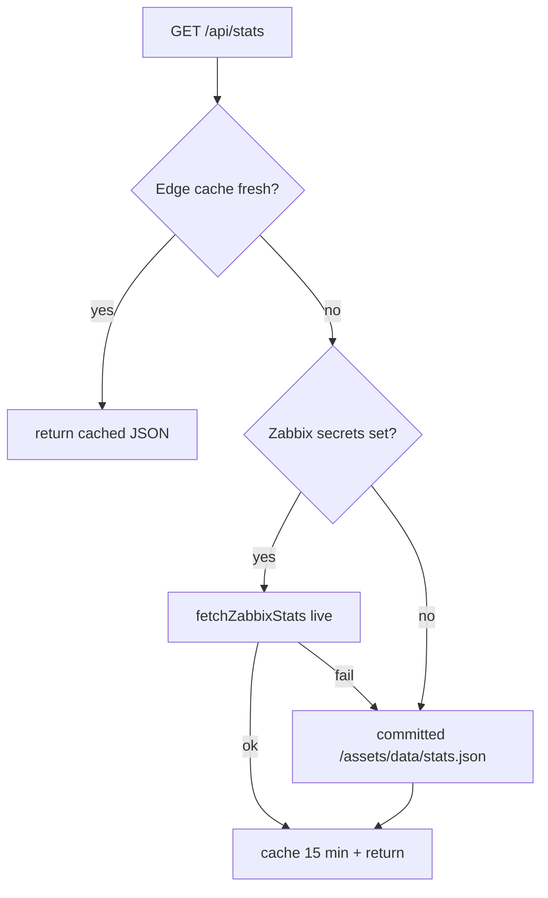

# Decoupling Plan — Front-End / Back-End split

How `site2.0` moves from a single static bundle toward a **presentation layer**
(HTML shells) that talks to a **data/API layer** over versioned endpoints. This
document covers **Phase 0** (content/data decoupling — no back-end) and
**Phase 1** (the first owned API endpoint, `/api/stats`), both of which are
implemented on this branch, plus the roadmap for later phases.

> Read [`ARCHITECTURE.md`](ARCHITECTURE.md) first. The one-line summary of the
> starting point: the site has **no owned back-end** — "dynamic" behavior is
> third-party SaaS (Web3Forms, JotForm, Tidio, GA4) plus one scheduled pipeline
> that commits `stats.json`. Decoupling means introducing a clean seam between
> *content* and *presentation*, then serving the truly dynamic bits from our own
> `/api/*` endpoints.

- [The contract: endpoints](#the-contract-endpoints)
- [Phase 0 — content/data layer](#phase-0--contentdata-layer)
- [Phase 1 — `/api/stats`](#phase-1--apistats)
- [Run it locally](#run-it-locally)
- [Deploying](#deploying)
- [Roadmap — Phases 2–4](#roadmap--phases-24)
- [Risks & non-goals](#risks--non-goals)

---

## The contract: endpoints

The **endpoint is the interface** between the two ends. Once these are frozen
and versioned, the front-end and back-end can evolve independently.

| Endpoint | Method | Replaces today | Phase |
|---|---|---|---|
| `/content/{file}.json` | GET (static) | Hard-coded HTML copy | 0 |
| `/api/stats` | GET | Committed `assets/data/stats.json` | **1** |
| `/api/leads` | POST | Web3Forms `fetch()` ×2 + JotForm | 2 |
| `/api/blog` | GET | 3 public CORS proxies in the browser | 3 |
| `/api/content/{page}/{lang}` | GET | Static `/content/*.json` (optional CMS) | 4 |

Payload shape for `/api/stats` (stable contract):

```json
{ "devices": 505, "problems": 1408, "updated_at": "2026-06-13T14:14:55Z", "source": "zabbix" }
```

`source` ∈ `zabbix` (live) · `fallback` (committed JSON) · `default` (hard fallback).

---

## Phase 0 — content/data layer

**Goal:** get content *out of the markup* so pages become presentation shells.
This is the biggest "decoupling" win and it needs **no back-end** — it stays
100% static and GitHub-Pages-friendly.

### What was added

```
content/
├── site.json        # brand, contact, nav, footer  (global chrome)
├── services.json    # the three service cards (section + items[])
├── home.json        # hero + stats strip copy
└── README.md        # the content schema (the "content node" shape)

scripts/
└── content.js       # front-end render layer: hydrates [data-content] from JSON
```

### How it works

A page marks a slot with `data-content="<file>.<dot.path>"`; `scripts/content.js`
fetches the JSON once per file and fills the element. Leaf values are either a
plain string or a **content node** `{ text | html, i18n?, href? }`.

```html
<h3 data-content="services.items.0.title"></h3>
<p  data-content="home.hero.subhead"></p>
<a  data-content="site.contact.email" data-content-attr="href:mailto"></a>
```

### i18n note (update: the translation engine was retired)

This section originally described how the content layer cooperated with
`scripts/i18n.js` (content node's `i18n` key → `data-i18n` attribute → engine
translates it). That engine has since been **retired** — the site is
Portuguese-only now, since `glctechsec.com` covers other locales — so
`content.js` still sets the `i18n` key as a `data-i18n` attribute for
backwards compatibility, but nothing reads it anymore. Content files hold the
Portuguese default and that's the only copy that ships. Phase 4's
`/api/content/{page}/{lang}` idea (below) is moot for the same reason unless
per-language content becomes relevant again.

### Non-destructive rollout

Phase 0 ships the machinery + [`/content-demo.html`](../content-demo.html), a
`noindex` page proving hydration end-to-end **without editing the production
pages**. Converting `index.html`'s hard-coded copy to `data-content` slots is a
follow-up, page-by-page, each independently shippable and reversible (delete the
attribute → static copy is still there).

---

## Phase 1 — `/api/stats`

**Goal:** the first real **owned** endpoint. Turn the "commit `stats.json` to
git" pipeline into a live, cached API — while keeping the fail-soft behavior.

### What was added

```
functions/
└── api/
    ├── stats.js          # Cloudflare Pages Function → routes to /api/stats
    └── _lib/
        └── zabbix.mjs     # runtime-agnostic Zabbix core (shared, not routed)

scripts/
└── dev-api.mjs           # local Node dev server (static site + /api/stats)
```

### Behavior



- **Shared core.** `functions/api/_lib/zabbix.mjs` mirrors the existing Python
  pipeline (Zabbix 7.x JSON-RPC, Bearer auth, enabled hosts + active problems).
  It takes an injected `fetch`, so the identical code runs in the Cloudflare
  Workers runtime *and* in Node (dev server) — verified by a mocked-RPC test.
- **Secrets stay server-side.** `ZABBIX_URL` / `ZABBIX_USER` / `ZABBIX_PASS`
  live in the Pages project env, never in the browser bundle. This is the
  security payoff of an owned back-end.
- **Fail-soft.** Missing secrets or a Zabbix outage → the committed JSON →
  a hard-coded default. The front-end (`index.html`) also keeps its own second
  fallback to `/assets/data/stats.json`, so the counter never breaks.

### Front-end change

`index.html`'s stats script now calls `getStats()`, which tries `/api/stats`
first and falls back to `/assets/data/stats.json`. Both return the same shape,
so the animation code is unchanged.

### Relationship to the existing GitHub Action

The daily `zabbix-stats.yml` workflow can stay as the **fallback producer**
(keeps `stats.json` warm for when the API degrades) or be retired once the
endpoint is trusted. No need to remove it in this phase.

---

## Run it locally

No build, no dependencies (Node 18+):

```bash
node scripts/dev-api.mjs         # → http://localhost:8787
```

Then:

- Demo: <http://localhost:8787/content-demo.html> — Phase 0 + Phase 1 together
- Endpoint: <http://localhost:8787/api/stats>
- Content: <http://localhost:8787/content/services.json>

Without Zabbix secrets the endpoint returns the committed stats with
`"source":"fallback"`. To exercise the **live** path:

```bash
ZABBIX_URL=https://zbx.example.com ZABBIX_USER=api ZABBIX_PASS=secret \
  node scripts/dev-api.mjs
```

---

## Deploying

Phase 1 introduces functions, which **GitHub Pages cannot run**. Recommended
target: **Cloudflare Pages** (hosts the static site *and* `functions/` with zero
config, closest to today's model).

1. Connect the repo to Cloudflare Pages; build command: *none*; output dir: `/`.
2. Add env vars `ZABBIX_URL`, `ZABBIX_USER`, `ZABBIX_PASS` (Production).
3. Point the `glctech.com.br` DNS/`CNAME` at Pages.
4. `functions/api/stats.js` is auto-discovered → `/api/stats`.

Portable to Vercel/Netlify: copy the `onRequestGet` body into their function
signature — `_lib/zabbix.mjs` is unchanged. Phase 0 alone (content layer) still
works on **plain GitHub Pages**, since it's just static JSON + a script.

---

## Roadmap — Phases 2–4

| Phase | Endpoint | Work | Business value |
|---|---|---|---|
| **2** | `POST /api/leads` | One endpoint for contact + diagnostic + ebook; server-side validation + spam check; store in DB/CRM, optionally forward to email | **Own your leads** instead of renting Web3Forms/JotForm |
| **3** | `GET /api/blog` | Move the RSS fetch server-side; drop the 3 public CORS proxies; hide the rss2json key | Reliability + no exposed keys |
| **4** | `GET /api/content/{page}/{lang}` | Back `/content` with a headless CMS; serve per-language content | Non-devs edit copy; smaller i18n payload |
| **4+** | *(optional)* SSG front-end (Astro) | Component-ize the duplicated nav/footer; build-time fetch of content | Kills per-page duplication, keeps SEO |

---

## Risks & non-goals

- **SEO first.** This is a marketing site; static HTML is a feature. Prefer
  build-time/SSG rendering over a runtime SPA so crawlers still get full HTML.
  Phase 0 keeps HTML intact; do **not** convert to a client-rendered SPA.
- **Hosting move** (Pages → Cloudflare/Netlify/Vercel) is required for any
  `/api/*`. Phase 0 does not require it.
- **Keep `CNAME`** and re-wire GA4 on the new host.
- **Non-goal:** rewriting the email/HTML template (`mailmkt.html`) — it stays
  as-is. (The i18n engine this used to mention was retired — see the note
  above.)
- **Ops:** an owned back-end means owning uptime, CORS, and secrets. The
  fail-soft fallbacks are deliberate so a back-end outage degrades to today's
  static behavior rather than a broken page.
