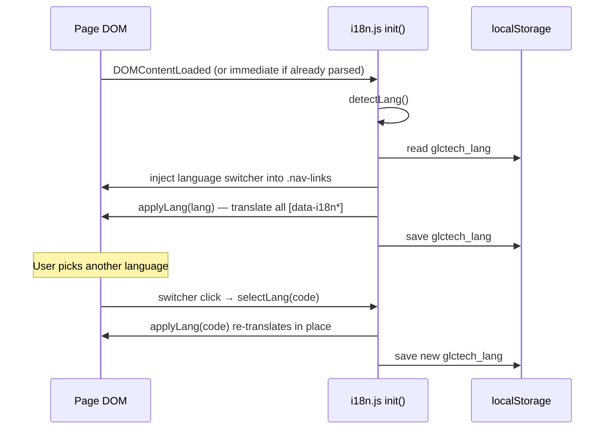

# Internationalization (i18n)

Everything about the translation system. This is the most important shared
subsystem on the site, and also the one with the most historical confusion
(three earlier *dead* attempts were removed — see
[Legacy files](#legacy-files-removed)).

- [TL;DR](#tldr)
- [The only file that matters](#the-only-file-that-matters)
- [How a page gets translated](#how-a-page-gets-translated)
- [The `data-i18n*` attributes](#the-data-i18n-attributes)
- [Language detection order](#language-detection-order)
- [Recipes](#recipes)
  - [Add/change a translation for existing text](#addchange-a-translation-for-existing-text)
  - [Make a new element translatable](#make-a-new-element-translatable)
  - [Add a whole new language](#add-a-whole-new-language)
- [Coupling with other features](#coupling-with-other-features)
- [The recursion trap (do not reintroduce)](#the-recursion-trap-do-not-reintroduce)
- [Legacy files (removed)](#legacy-files-removed)

---

## TL;DR

- The live i18n engine is **`scripts/i18n.js`**. Every customer-facing page
  loads it with `<script src="scripts/i18n.js"></script>`.
- Translatable content is marked in the HTML with **`data-i18n="some.key"`**.
- All translations live in **one big `translations` object inside
  `i18n.js`**, keyed by language (`pt`, `en`, `de`, `es`, `fr`, `it`).
- Supported languages: 🇧🇷 pt · 🇺🇸 en · 🇩🇪 de · 🇪🇸 es · 🇫🇷 fr · 🇮🇹 it.
  Default/fallback is **pt** (Brazilian Portuguese).
- The user's choice is saved in `localStorage['glctech_lang']`.

---

## The only file that matters

```
scripts/i18n.js
```

Its structure (top to bottom):

1. `var translations = { pt: { 'key': 'value', … }, en: { … }, … }`
   — the dictionary. `pt` is the master list; other languages mirror its keys.
2. `localeMap` — maps browser locales (e.g. `pt-br`, `en-us`) to a supported
   language code.
3. `detectLang()` — decides which language to show.
4. `t(key, lang)` — look up one key, falling back to `pt` then to the key
   itself.
5. `applyLang(lang)` — walk the DOM and translate everything.
6. `buildSwitcher()` — create the nav language dropdown (with its own CSS).
7. `init()` — inject the switcher and call `applyLang(detectLang())`.
8. A public handle: `window.glcI18n = { apply, t, _translations }`.

---

## How a page gets translated



`applyLang()` also updates `<html lang>`, `document.title` (via the
`page.title` / `page.lang` keys), and the form-validation error strings.

---

## The `data-i18n*` attributes

There are **three** attributes, chosen by *what* you need to translate:

| Attribute | Translates | Example |
|-----------|-----------|---------|
| `data-i18n` | the element's **text** (`textContent`) | `<h2 data-i18n="about.h2">Especialistas…</h2>` |
| `data-i18n-html` | the element's **innerHTML** (use when the value contains markup like `<br>`) | `<h2 data-i18n-html="services.h2">Tudo…<br>parceiro</h2>` |
| `data-i18n-attr` | an **attribute** of the element; pair it with the target attribute name | `<input data-i18n="form.nome.ph" data-i18n-attr="placeholder">` |

Notes:

- For `data-i18n-attr`, the **key** is still read from `data-i18n` (or from the
  attribute value itself), and the **target attribute name** is the *value* of
  `data-i18n-attr` (e.g. `placeholder`, `aria-label`).
- The HTML ships with the Portuguese text already in place, so the site is
  readable even if JS fails — translation is an enhancement, not a requirement.

---

## Language detection order

`detectLang()` returns the first match:

1. **Saved preference** — `localStorage['glctech_lang']`, if it's a supported
   language.
2. **Browser languages** — walks `navigator.languages`; maps each locale
   (full then base, e.g. `pt-BR` → `pt`) through `localeMap`.
3. **Default** — `pt`.

So a returning visitor keeps their choice; a first-time visitor gets their
browser language if we support it, otherwise Portuguese.

---

## Recipes

### Add/change a translation for existing text

The element already has `data-i18n="foo.bar"`. Edit the value for **every
language** in `translations` inside `scripts/i18n.js`:

```js
var translations = {
  pt: { /* … */ 'foo.bar': 'Texto em português', /* … */ },
  en: { /* … */ 'foo.bar': 'English text',        /* … */ },
  de: { /* … */ 'foo.bar': 'Deutscher Text',      /* … */ },
  // es, fr, it …
};
```

If you only add the key to `pt`, the other languages fall back to the pt value
(via `t()`), so the site won't break — but it won't be translated either.

### Make a new element translatable

1. Pick a **dot-namespaced key** following the existing scheme
   (`section.subsection.item`, e.g. `about.pillar4.h`).
2. Add the attribute in the HTML:
   ```html
   <h4 data-i18n="about.pillar4.h">Texto padrão em PT</h4>
   ```
3. Add the key + value to **each** language block in `scripts/i18n.js`.

> The PT text in the HTML and the `pt` value in the dictionary should match, so
> nothing "flips" on load for Portuguese visitors.

### Add a whole new language

Say you want 🇳🇱 Dutch (`nl`):

1. In `scripts/i18n.js`, add a full `nl: { … }` block to `translations` —
   copy the `pt` block and translate every value (keep the keys identical).
2. Add `nl` to the switcher metadata in `buildSwitcher()`:
   ```js
   var flags = { pt:'🇧🇷', en:'🇺🇸', de:'🇩🇪', es:'🇪🇸', fr:'🇫🇷', it:'🇮🇹', nl:'🇳🇱' };
   var names = { pt:'PT', en:'EN', de:'DE', es:'ES', fr:'FR', it:'IT', nl:'NL' };
   ```
3. Add locale mappings to `localeMap` so auto-detection works:
   ```js
   'nl': 'nl', 'nl-nl': 'nl', 'nl-be': 'nl',
   ```
4. Test: set `localStorage.glctech_lang = 'nl'` in the console and reload, or
   pick it from the switcher.

---

## Coupling with other features

`applyLang()` doesn't only touch `data-i18n` elements. Be aware it also:

- Sets `document.documentElement.lang` and `document.title`
  (keys `page.lang`, `page.title`).
- Rebuilds `window._i18n_errors` — the **contact form** reads these for its
  localized validation messages. If you add a form error string, add its key
  (`form.err.*`) to the dictionary.
- Calls `window._glcSelectLang(lang)` to sync the switcher's visible
  flag/name/active state (see the trap below).

The **Tidio chatbot** independently reads the same `localStorage['glctech_lang']`
key to pick its language (`document.tidioChatLang`). It does not go through
`i18n.js`; it just reads the stored value. Keep the storage key name in sync if
you ever rename it.

---

## The recursion trap (do not reintroduce)

There are two functions in `buildSwitcher()`:

- `syncSwitcherUI(code)` — updates **only** the switcher's flag/name/active
  classes. Does **not** translate.
- `selectLang(code)` — calls `syncSwitcherUI(code)` **and** `applyLang(code)`.
  This is what a user's click runs.

`applyLang()` needs to keep the switcher visuals in sync, so it calls
`window._glcSelectLang`. **That handle must point at `syncSwitcherUI` (UI only),
NOT at `selectLang`.**

If it points at `selectLang`, you get:

```
applyLang → _glcSelectLang(=selectLang) → applyLang → selectLang → …  💥
RangeError: Maximum call stack size exceeded   // on every page load
```

This exact bug existed and was fixed by splitting the UI-only function out.
Keep them separate.

---

## Legacy files (removed)

Three earlier translation attempts used to live in the repo. They were **never
loaded by any page**, used a different/incompatible key scheme, and have been
**removed** to avoid confusion:

| File (removed) | Old scheme |
|----------------|-----------|
| `js/i18n.js` | fetched `/lang/{lang}.json`, keys like `nav_about` |
| `lang.js` | nested object `translations.pt.nav.home` |
| `lang/en.json`, `lang/pt.json` | flat JSON, keys like `nav_about` |

If you run into references to them in old branches or git history, ignore them.
The live pages use flat **dot** keys (`nav.about`) read from the dictionary
**embedded** in `scripts/i18n.js`. If you ever want to externalize translations
into JSON later, that's a deliberate refactor — build one clean system and wire
every page's `<script>` tag to it, rather than resurrecting these.
